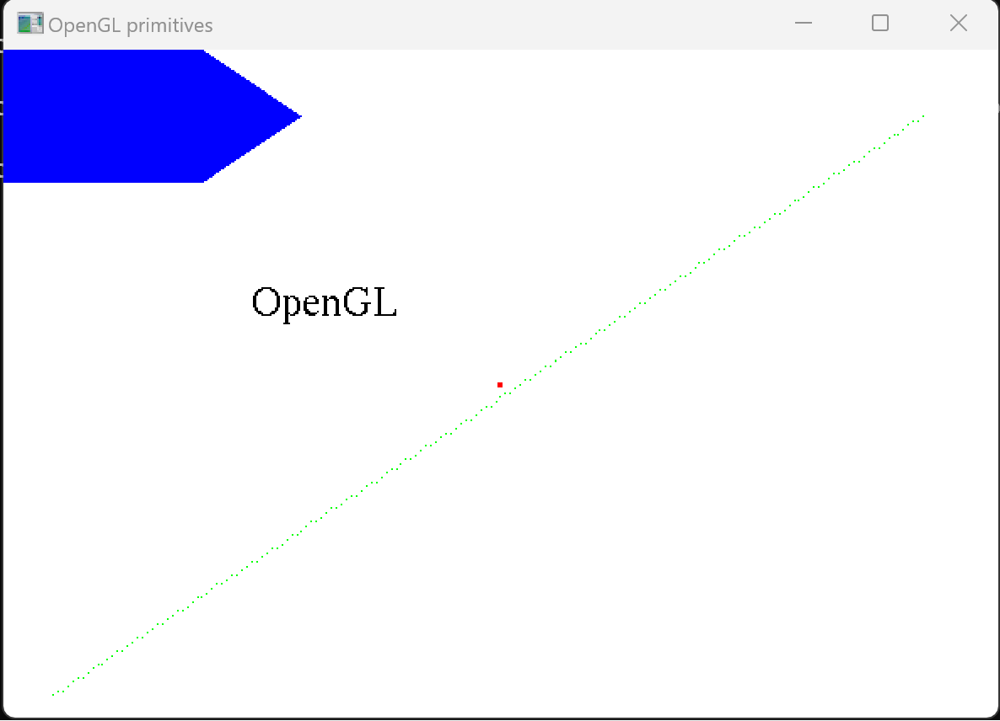
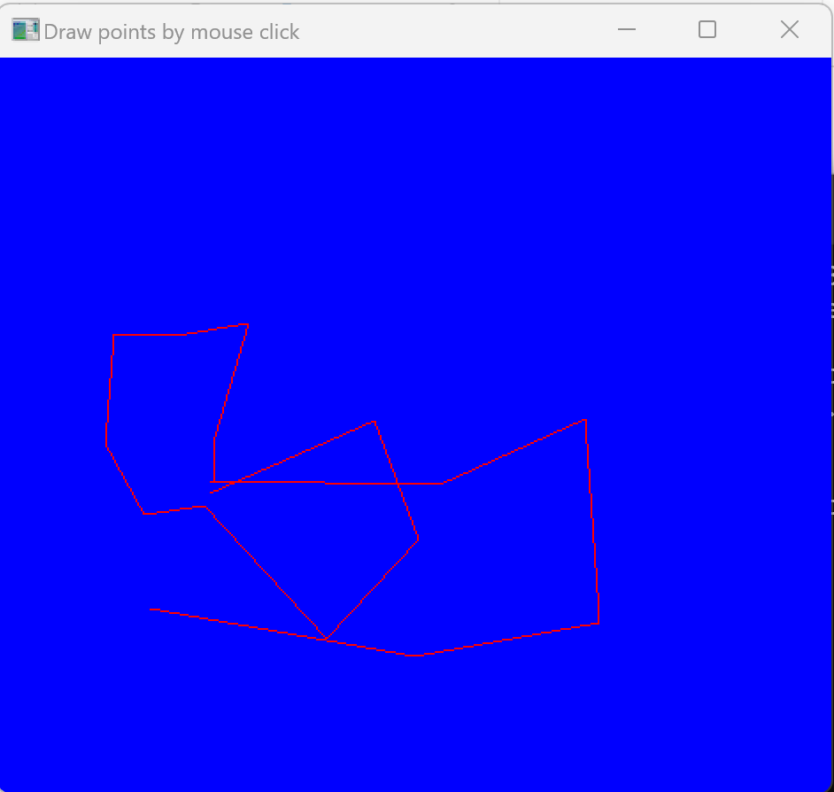
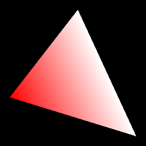
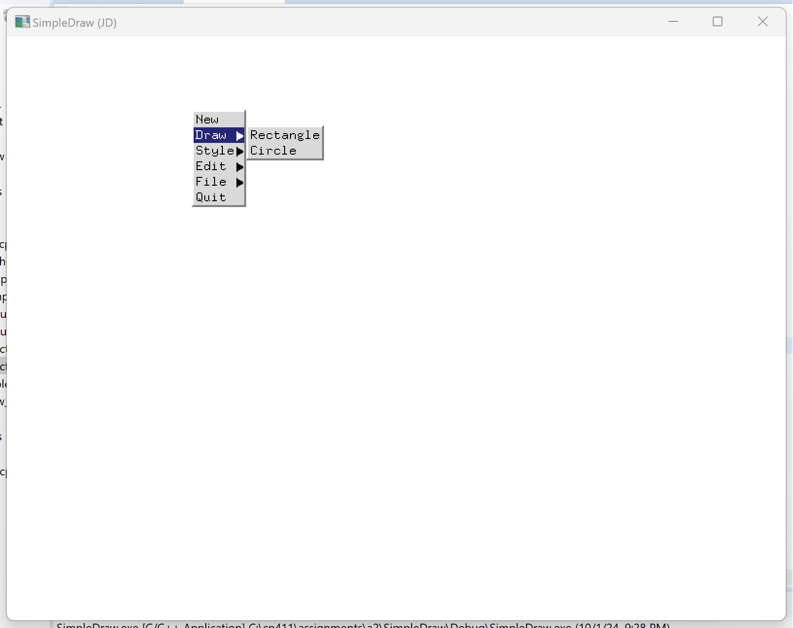
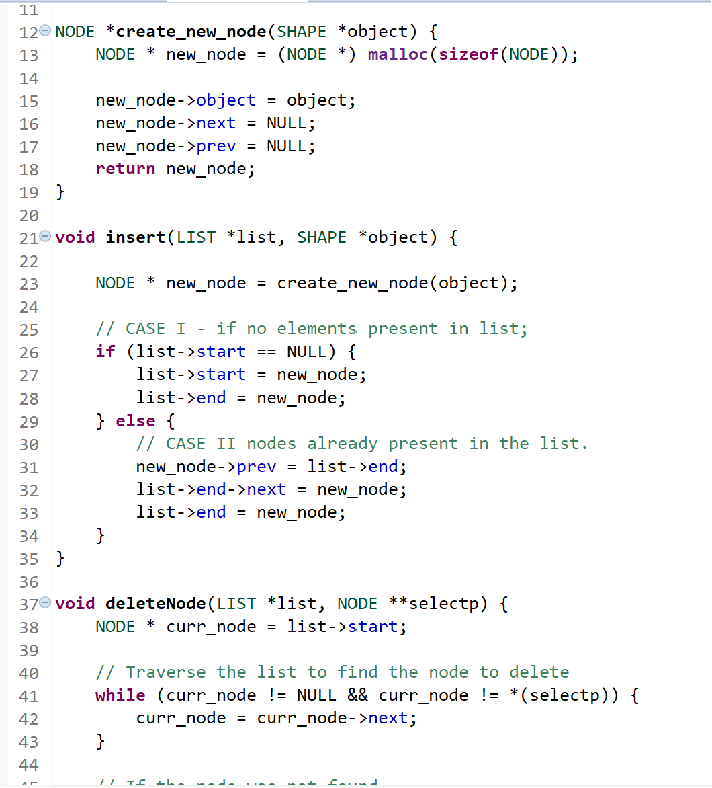
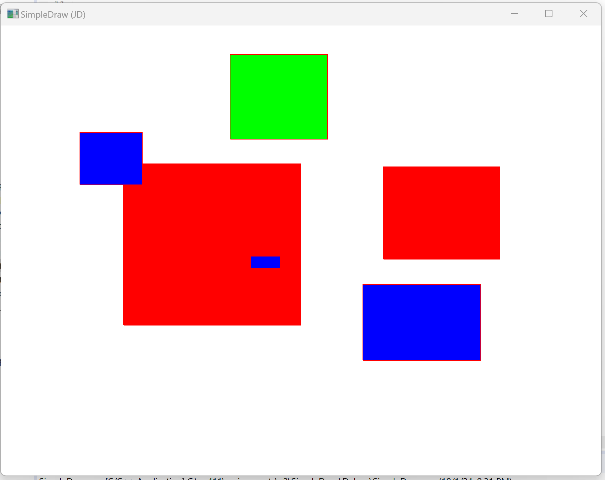
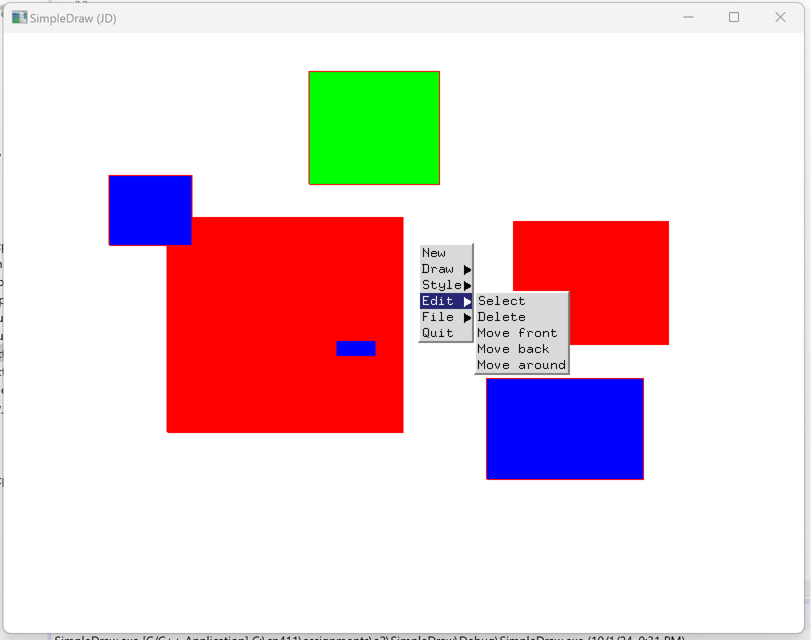

# A2 Report

Author: Jashandeep Singh 

Date: 2024-09-26 

Check [readme.txt](readme.txt) for course work statement and self-evaluation. 
  
## Q1 Graphics pipeline (description)

### Q1.1 Graphics primitives

Graphic primitives are the basic building blocks used in computer graphics to create 2D/3D models objects.  These include points, lines, curves, polygons, and surfaces. By combining these primitives in different ways, more complex model objects can be created. Model objects are rendered by converting constituent primitives into pixels to produce the final image.

### Q1.2 Graphics pipeline operations

Graphics pipeline refers to a set of procedures for transforming a three-dimensional scene  into a two-dimensional representation on screen.

- The operations in a graphics pipeline are:
	- Graphic Object Geometry
	- Modelling Transformations
	- Lighting Calculations
	- Viewing Transformations
 	- Culling, Clipping
	- Projection Transform
	- Rasterize

### Q1.3 Coordinate systems & transformations

Coordinate Systems Involved in the graphics pipeline are 

- <strong>Model Coordinate System(MCS)</strong>: MCS is the local coordinate system of a object. Primitives that constitutes an object are defined relative to this system.

- <strong>World Coordinate System(WCS)</strong>: WCS is the system that presents the entire scene. After the first transformation in the graphics pipeline, objects are placed using this system in the scene.

- <strong>Viewer Coordinate System(VCS)</strong>: Coordinate system as viewed from the perspective of the of the eye of the viewer. 

- <strong>Normalized Device Coordinate System (NDCS)</strong>: NDCS is the system that describes positions on virtual plotting device. The lower left corner corresponds to (0,0) and upper right corresponds to (1,1).

- <strong>Device Coordinate System(DCS)</strong>: Coordinate system with respect to screen on which the image is being drawn.

Transformations involved in the graphics pipeline are:

- <strong>Modeling Transform</strong>:In this transform operation, Model coordinate system is converted into world coordinate system. This transformation translate, rotates and scales object so that it can be place correctly in the global scene.

- <strong>Viewing Transform</strong>:This transformation converts the world coordinate system to viewer coordinate system. This transformation positions the viewers eye in the scene and transform the image so that is viewed from the viewer's perspective.

- <strong>Projection Transform</strong>:VCS to NDCS. This transformation converts the 3D scene into 2D scene for rendering.

- <strong>Display Transform</strong>: NDCS to DCS. This transformation maps the normalized device coordinates to actual pixel positions on screen.

### Q1.4 Scan conversion

Scan conversion algorithm, also know as rasterization algorithms, convert the primitives that constitute a model object into pixels in the last step of the graphics pipeline, and render to framebuffer.  

### Q1.5 Hand-on Midpoint algorithm

Write you answer on paper, write your name on the paper, take a picture and save it in the image folder, and link as follows.  

{width=90%}

## Q2 OpenGL and Glut (lab practice)

### Q2.1 OpenGL primitives 

Complete? Yes

<!--If you answer Yes, insert a screenshot image to show the completion.-->

{width=90%}

<!-- If No, add a short description to describe the issues encountered.-->

### Q2.2 Interactive graphics 

Complete? Yes 

<!--If you answer Yes, insert a screenshot image to show the completion.-->

{width=90%}

<!-- If No, add a short description to describe the issues encountered.-->

### Q2.3 Bitmap file I/O 

Complete? Yes 

<!--If you answer Yes, insert a screenshot image to show the completion.-->

{width=90%}

<!-- If No, add a short description to describe the issues encountered.-->

## Q3 SimpleDraw (programming)

### Q3.1 Display window and menu

Complete? Yes or No 

<!--If you answer Yes, insert a screenshot image to show the completion. -->

{width=90%}

<!--If No, add a short description to describe the issues encountered.-->

### Q3.2 Data structures

Complete? Yes or No 

<!--If you answer Yes, insert a screenshot image to show the completion. -->

{width=90%}

<!--If No, add a short description to describe the issues encountered.-->

### Q3.3 Draw rectangles

Complete? Yes or No 

<!--If you answer Yes, insert a screenshot image to show the completion. -->

{width=90%}

<!--If No, add a short description to describe the issues encountered.-->

### Q3.4 Draw circles

Complete?  No 

<!--If you answer Yes, insert a screenshot image to show the completion. -->

{width=90%}

<!--If No, add a short description to describe the issues encountered.-->

### Q3.5 Edit features

Complete? Yes

<!--If you answer Yes, insert a screenshot image to show the completion. -->

{width=90%}

<!--If No, add a short description to describe the issues encountered.-->

### Q3.6 Save/Open SVG files

Complete? Yes or No

If you answer Yes, link the image
.

### Q3.7 Export to bitmap

Complete? Yes or No

If you answer Yes, link the image
.

### Q3.8 Circle&Square artwork

Complete? Yes or No

If you answer Yes, link the images
[C&S artwork in SVG](images/c&s.svg)
.

**References**

1. CP411 a2
2. Add your references if you used any. 
